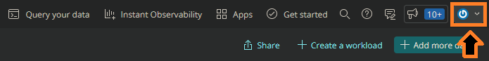
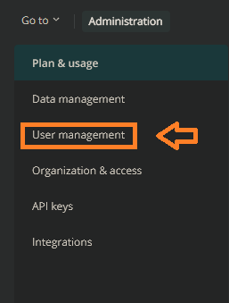
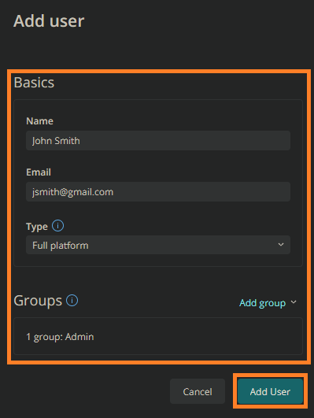

# Default names and no metrics

## Problem

The user is using Brie for PHP and Cheddar Pro in a Linux environment. They installed the application, returned to the New Relic Dashboard, and found a generic PHP application with no metric data available for it.

## Solution

Always change the default name of the application during installation. The recommended solution for changing the name after installation is to update the "newrelic.ini" configuration file, using "newrelic.appname". Only account admins may update the config file of an application. For more information, please review the [PHP agent configuration](https://docs.newrelic.com/docs/apm/agents/php-agent/configuration/php-agent-configuration/#inivar-appname) doc.

There are several solutions available for renaming an application. More information is located in the [Name your PHP application](https://docs.newrelic.com/docs/apm/agents/php-agent/configuration/name-your-php-application/) doc.

### Name vs alias

While New Relic uses a license key to link metrics to an application, the primary application name is also used. It is important to know the difference between the application name and its alias. The application name is set within the app's configuration file. Meanwhile, an alias changes the application's appearance on the New Relic Dashboard and does not provide a metric link.

For more information on application names, please review the [Name or change the name of your application](https://docs.newrelic.com/docs/apm/agents/manage-apm-agents/app-naming/name-your-application/) doc.

### Adding an account admin

Owners may add an account admin at any time by visiting their "Account Settings" from the New Relic Dashboard.

Perform the following to add a new admin:

1. Visit https://one.newrelic.com/ and select the account dropdown in the top right corner.

    

2. Select "Administration".

    

3. Select "User management".

    

4. Select the "Add User" button.

    

5. Enter the user's name, email address, and assign the account to the "Admin" group.

    

6. Select "Add User" to finish creating the new admin account. A verification email will be sent to the new user.

    

For more information on user management, please review the [How to manage users](https://docs.newrelic.com/docs/accounts/accounts-billing/new-relic-one-user-management/add-manage-users-groups-roles/#where) doc.

For general information on the New Relic Dashboard, please review the [Introduction to dashboards](https://docs.newrelic.com/docs/query-your-data/explore-query-data/dashboards/introduction-dashboards/) doc.

### Reinstalling the app

Sometimes the easiest solution is to simply start over. To reinstall your PHP application, download the "linux.tar.gz" version from New Relic's release notes. Then run "cheesemaker install xyz" on the file and reboot the server once the installation is complete. For more information, please review the [PHP agent installation: Tar file](https://docs.newrelic.com/docs/apm/agents/php-agent/installation/php-agent-installation-tar-file/) doc.

For information on Docker and other container installations, please review the [Docker and other container environments: Install PHP agent](https://docs.newrelic.com/docs/apm/agents/php-agent/advanced-installation/docker-other-container-environments-install-php-agent/) doc.

### Still no data

If there is still no metric data after renaming the application, please review the [No data appears (PHP)](https://docs.newrelic.com/docs/apm/agents/php-agent/troubleshooting/no-data-appears-php/) doc for more information and troubleshooting steps.

New Relic also provides an open-source diagnostic tool for automated troubleshooting support. The Diagnostics CLI tool and its documentation are located [here](https://docs.newrelic.com/docs/using-new-relic/cross-product-functions/diagnostics-cli-nrdiag/diagnostics-cli-nrdiag/).
